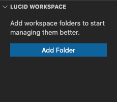
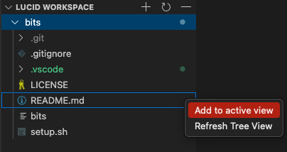
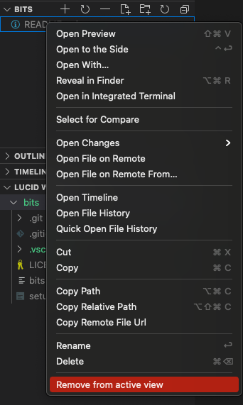
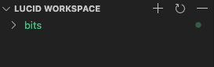

# 🗂 Lucid-workspace

[  ](https://marketplace.visualstudio.com/items?itemName=rohit04saluja.lucid-workspace)

> An extension to seemlessly manage large workspaces

## 🖋 Inspiration

Getting lost while working with a large workspace is a real problem. It can get hard to find files and folders of workspace in explorer view. Multiple open folder tress can eat up your explorer view space.
Lucid workspace aims to help you declutter. It provides you with an intuitive way to only see what is important.

---

## 🚀 Get started

_lucid-workspace_ activates when there is an open workspace folder.

When active, _lucid-workspace_ can be found at ```Explorer```.

### 1 - _the welcome page_

<table>
    <tr>
        <td></td>
        <td>
            <p>This is the welcome screen. Add <code>Workspace Folder</code> to see the tree view.</p>
            <p>This hides the folder tree from Explorer, but can be viewed here</p>
        </td>
    </tr>
</table>

### 2 - _add to active view_

> _Active View_ refers to all the visible files in the ```Explorer```.

<table>
    <tr>
        <td></td>
        <td>
            <p>Select files/folders from <code>Lucid Workspace</code> view to add to <i>Active View</i>.</p>
            <p>You should view the selected file/folder in <code>Explorer</code> view.</p>
        </td>
    </tr>
</table>

### 3 - _remove from active view_

<table>
    <tr>
        <td></td>
        <td>
            <p>Select the files/folders, added peviously from <code>Lucid Workspace</code> view, to remove form <code>Explorer</code> view.</p>
        </td>
    </tr>
</table>

### 4 - _buttons_

<table>
    <tr>
        <td></td>
        <td>
            <ol>
                <li>Button to add a workspace folder to <code>Lucid Workspace</code>.</li>
                <li>Button to refresh <code>Lucid Workspace</code> view.</li>
                <li>Button to remove folder from <code>Lucid Workspace</code>.</li>
            </ol>
        </td>
    </tr>
</table>

---

## Configurations

1. `lucid-ws.folders`: All the workspaces folders added to _Lucid Workspace_

2. `lucid-ws.filters`: All files/folders to unhide from _Explorer View_

---

## Commands

1. `Add to active view`: Add a file/folder to active view.

2. `Remove from active view`: Remove file/folder from active view.

3. `Add Workspace Folder`: Add a workspace folder to _Lucid Workspace_

4. `Remove Workspace Folder`: Remove a workspace folder from _Lucid Workspace_

5. `Refresh Tree View`: Refresh the tree view of _Lucid Workspace_

---

## 📝 Release Notes

See [CHANGELOG.md](CHANGELOG.md) for detailed notes

---

## 🎗 Support

Found a bug or need a new feature? Post it in the <a href="https://github.com/rohit04saluja/lucid-workspace/issues">issue tracker</a>.

---

## 👨🏽‍💻 Contributors

Created by Rohit Saluja (<a href="https://github.com/rohit04saluja/">rohit04saluja</a>)
